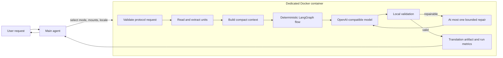

# translator-agent

A cost-aware translation skill for AI coding agents. It runs a deterministic
LangGraph worker inside Docker and sends translation-only work to a configurable
OpenAI-compatible model endpoint.

The main agent remains responsible for understanding the user, choosing files
and presenting results. Repetitive translation is delegated to a smaller
flash-class model so that a premium reasoning model does not spend its context
window and token budget on a predictable language task.

## Why use this skill?

- **Reduce premium-model usage.** Route straightforward translation to a
  lower-cost model while the main agent focuses on planning and integration.
- **Keep translation context small.** Send only the current batch, locale
  requirements, relevant terminology and a strict output contract.
- **Use your own endpoint.** OpenAI, NVIDIA, OpenRouter and self-hosted
  OpenAI-compatible APIs share the same transport interface.
- **Make output reusable.** Return versioned JSON/YAML translation bundles with
  stable unit IDs instead of unstructured prose.
- **Keep work contained.** Parsing, prompting, model calls, validation, retries
  and file writes happen inside a dedicated Docker container.
- **Measure real usage.** Persist model calls, provider requests, input/output
  tokens, reasoning tokens, endpoint-reported cost and usage completeness.

This is intentionally not an autonomous general-purpose agent. The workflow is
bounded, translation-specific and designed to make cost and failure behavior
predictable.

## Quick start

### Fastest path: ask your agent

Give your agent this repository URL:

```text
https://github.com/WarrenTS/skill-translator-agent
```

Then ask:

```text
Inspect this repository's README.md and SKILL.md, install the translator-agent
skill for me, build the translator-agent:local Docker image, and create a blank
.transenv template in my workspace. Do not ask me to paste credentials into the
conversation; stop and let me fill them in locally.
```

The manual installation steps are below if you prefer to review and run each
command yourself.

### 1. Install the skill

Clone the repository into the skills directory used by your agent host. For
Codex, a typical personal installation is:

```bash
git clone https://github.com/WarrenTS/skill-translator-agent.git \
  ~/.codex/skills/translator-agent
cd ~/.codex/skills/translator-agent
```

If your host discovers skills from another directory, clone or symlink this
folder there instead. The folder name must remain `translator-agent`.

### 2. Build the runtime image

```bash
docker build --target runtime -t translator-agent:local .
```

All translator runtime code and Python dependencies are installed in the image;
no host-side Python environment is required.

### 3. Configure a workspace

Create `.transenv` in the workspace containing the files you want to translate:

```bash
cp ~/.codex/skills/translator-agent/assets/transenv.template \
  /path/to/workspace/.transenv
chmod 600 /path/to/workspace/.transenv
```

Edit it locally:

```dotenv
TRANSLATOR_PROVIDER=
TRANSLATOR_API_BASE_URL=
TRANSLATOR_MODEL=
TRANSLATOR_AUTH_MODE=
TRANSLATOR_API_KEY=
```

Never paste the key into an agent conversation and never commit `.transenv`.
Set `TRANSLATOR_PROVIDER` to `openai`, `nvidia`, `openrouter` or `custom`, and
set `TRANSLATOR_AUTH_MODE` to `required`, `optional` or `none`.
For a trusted self-hosted endpoint, a blank key is valid when
`TRANSLATOR_PROVIDER=custom` and `TRANSLATOR_AUTH_MODE=optional` or `none`.

### 4. Ask the main agent to use the skill

Examples:

```text
Use $translator-agent to translate this sentence into Japanese and Korean:
明天早上，我們要從林口出發往苗栗，再到台南
```

```text
Use $translator-agent to translate docs/guide.md into zh-TW and save it as
translated/guide.zh-TW.md. Also save the run metrics.
```

```text
Use $translator-agent to translate the JSON localization file into en and ja.
Keep keys, placeholders, Markdown and URLs unchanged.
```

On first use, the main agent checks for the workspace `.transenv`. If it is
missing, the skill instructs the agent to create a template, ask the user to
configure it locally, and stop before starting Docker.

## Supported operations

| Mode | Input | Result |
| --- | --- | --- |
| `translate_text` | Inline text | Return translated text or a translation bundle |
| `translate_text_to_file` | Inline text and output path | Write a validated artifact |
| `translate_file_to_file` | Mounted source file and output path | Preserve supported file structure |
| `translate_batch` | Multiple stable units or files | Translate all units and report partial failures |
| `custom` | Structured translation-specific instructions | Produce standard artifacts without granting arbitrary tools |

Current adapters support plain text, Markdown, JSON, YAML and CSV. Candidate
future modes include translation review and synchronization of stale
localization bundles; they are not advertised by the current runtime.

## Software dependencies

### Host

- Docker Engine or Docker Desktop
- Docker Compose v2 if using `compose.yaml`
- An agent host that can load a `SKILL.md` folder and invoke Docker
- An OpenAI-compatible endpoint and a model identifier
- An API key when required by the selected provider

### Container

The image is built from a pinned `python:3.12-slim-bookworm` digest and installs:

| Package | Version |
| --- | --- |
| Python | 3.12 |
| LangGraph | 1.2.9 |
| Pydantic | 2.13.4 |
| PyYAML | 6.0.2 |
| pytest (test image only) | 8.x |

Exact Python requirements live in [`pyproject.toml`](pyproject.toml). The
container communicates with the endpoint through an OpenAI-compatible
`/chat/completions` API.

## How the skill works



The main agent does not translate through its own model after selecting this
skill. It constructs a versioned JSON request, starts the container with narrow
input/output mounts, checks capabilities, sends the request through the
in-container control socket and presents the returned result.

### Compact context architecture

The translation model receives:

1. A short immutable translator policy.
2. Source and target locale tags.
3. Structured domain, audience and tone options.
4. Only glossary entries and protected tokens relevant to the current batch.
5. The current source units plus minimal neighboring context.
6. A strict JSON output schema.

It does **not** receive the main-agent conversation history, full protocol
documentation, tool schemas, credentials or unrelated files. Source text is
explicitly treated as untrusted data to translate, never as instructions to
follow.

The fixed policy in [`config/agent-context.yaml`](config/agent-context.yaml)
requires complete locale coverage, unchanged unit IDs, preservation of names,
facts, numbers, URLs, code, placeholders, markup and intended line boundaries.

### Deterministic tool and graph policy

The model cannot choose tools. LangGraph nodes directly invoke a small allowlist:

- read mounted input
- write validated output
- extract format-specific units
- validate translations
- call the configured translation endpoint

There is no shell, browser, arbitrary Python execution, generic URL fetch or
unrestricted filesystem tool. The standard path uses one model call per batch
and permits at most one targeted repair call after deterministic failure.

### Structured output and compatibility

The provider adapter prefers strict JSON Schema output, then JSON object mode,
then prompt-only JSON only when the endpoint explicitly rejects a stronger
format. The runtime records both:

- `model_calls`: attempts that may have consumed model tokens
- `provider_requests`: all HTTP requests, including parameter compatibility
  rejections that may not have generated tokens

OpenRouter reasoning is disabled by default. If an endpoint explicitly requires
reasoning, the same request may be resubmitted once with `minimal` effort.
Reasoning tokens are retained in metrics when the endpoint reports them.

### Adaptive cost controls

- Batch size scales with source length and target-locale count.
- Completion budget is derived from source length and capped by
  `TRANSLATOR_MAX_OUTPUT_TOKENS`.
- Provider and control-socket timeouts scale with input size, batch count and
  permitted repair passes.
- Missing endpoint usage remains unknown; it is never converted to zero.
- A separate `translator-agent/run-v1` record can survive container removal.

### Files and communication

Requests and responses use JSON. Human-editable saved bundles may use YAML:

```yaml
schema_version: translator-agent/v1
kind: translation_bundle
source_locale: zh-TW
target_locales: [en, ja]
units:
  - id: greeting.title
    source:
      text: 你好
      context: Onboarding title
    translations:
      en:
        text: Hello
        status: translated
      ja:
        text: こんにちは
        status: translated
    protected_tokens: []
```

Mounted input is read-only at `/work/input`; output is constrained to
`/work/output`. Absolute paths, `..`, symlink escapes and silent overwrites are
rejected. See [`references/protocol.md`](references/protocol.md) and
[`references/architecture.md`](references/architecture.md) for the full
contract.

## Benchmark

### Goal and setup

The benchmark tested whether low-cost models could translate a noisy
10,239-character English transcript into Traditional Chinese while preserving
structure and returning valid machine-readable output.

- Evaluator: **GPT-5.6 Sol (High)**
- Quality method: reference-free automated proxy
- Endpoint: OpenRouter
- Price basis: the lowest listed OpenRouter input/output price for each model,
  captured in [`benchmarks/prices.txt`](benchmarks/prices.txt)
- Standard context: compact translation-only policy
- Output: strict JSON Schema where supported
- Cost: calculated from reported input/output usage; `≥` denotes incomplete
  endpoint usage and therefore a lower bound

The quality proxy weights were:

- cross-model character unigram/bigram consensus: 35%
- completeness: 20%
- number and named-entity preservation: 20%
- Traditional Chinese compliance: 10%
- line-structure preservation: 10%
- target-language ratio: 5%

This is not a human semantic evaluation. Small differences, especially within
the leading group, should not be over-interpreted.

### Participating models and price snapshot

Prices are USD per one million input/output tokens and may change after the
snapshot. Check the current [OpenRouter model catalog](https://openrouter.ai/models)
before making purchasing or routing decisions.

| Model ID | Input / 1M | Output / 1M |
| --- | ---: | ---: |
| `google/gemma-4-26b-a4b-it` | $0.060 | $0.330 |
| `google/gemma-4-31b-it` | $0.100 | $0.350 |
| `deepseek/deepseek-v4-flash` | $0.090 | $0.180 |
| `z-ai/glm-4.7-flash` | $0.060 | $0.400 |
| `openai/gpt-oss-120b` | $0.030 | $0.180 |
| `openai/gpt-oss-20b` | $0.029 | $0.140 |

### Results

Final-run tokens include repair retries made inside that run. “Failed runs” are
earlier full invocations retained for experiment accounting; they are not the
same as an in-run repair retry.

| Rank | Model | Quality | Final tokens | Repair retries | Failed runs | Usage complete | Estimated final cost | Observed experiment tokens |
| ---: | --- | ---: | ---: | ---: | ---: | :---: | ---: | ---: |
| 1 | Gemma 4 31B | 85.99 | 6,175 | 0 | 0 | Yes | $0.001329 | 6,175 |
| 2 | DeepSeek V4 Flash | 85.91 | 6,252 | 0 | 0 | Yes | $0.000825 | 6,252 |
| 3 | Gemma 4 26B | 85.63 | 6,279 | 0 | 2 | Yes | $0.001172 | 30,661 |
| 4 | GLM 4.7 Flash | 84.50 | ≥8,233 | 2 | 1 | No | ≥$0.001663 | ≥20,935 |
| 5 | GPT-OSS 120B | 84.03 | 10,308 | 0 | 1 | Yes | $0.001376 | ≥17,860 |
| 6 | GPT-OSS 20B | 82.22 | ≥9,835 | 3 | 2 | No | ≥$0.000708 | ≥30,032 |

Machine-readable values are available in
[`benchmarks/results.csv`](benchmarks/results.csv).

### Model notes

- **Gemma 4 31B** — Highest quality proxy, complete usage and no repair
  retries. Stable final run, though more expensive than DeepSeek.
- **DeepSeek V4 Flash** — Only 0.08 points behind first place and the cheapest
  result with complete usage. It also preserved line structure best.
- **Gemma 4 26B** — Among the strongest at preserving numbers and named
  entities. The final run was stable, but two earlier failed runs increased
  total experiment cost.
- **GLM 4.7 Flash** — Complete translated content, but two repair retries and
  incomplete usage. Structure preservation was weaker than the leading group.
- **GPT-OSS 120B** — Reliable final run, but 3,890 reasoning tokens inflated
  output usage and provider-reported cost without a quality lead.
- **GPT-OSS 20B** — Low listed price, but three repair retries, 24 HTTP
  requests and incomplete usage reduced operational efficiency.

The benchmark is a small workload study, not a universal model ranking. Model
behavior, routed provider, pricing and endpoint support can change.

## Repository layout

```text
translator-agent/
├── SKILL.md                  # Instructions consumed by the main agent
├── agents/openai.yaml        # Skill UI metadata
├── assets/transenv.template  # Safe workspace configuration template
├── config/                   # Immutable worker context and tool allowlist
├── references/               # Protocol, provider and architecture details
├── src/translator_agent/     # Runtime implementation
├── tests/                    # Containerized tests
├── benchmarks/               # Public aggregate benchmark data
├── Dockerfile
├── compose.yaml
└── pyproject.toml
```

## Development and validation

Run the complete test suite in the test image:

```bash
docker build --target test -t translator-agent:test .
```

Build the production image:

```bash
docker build --target runtime -t translator-agent:local .
```

The test stage runs pytest during the image build. Remove the temporary test
image after validation if you want to keep only the runtime image.

## License

This project is released under the [MIT License](LICENSE), a short permissive
license approved by the [Open Source Initiative](https://opensource.org/license/mit).
